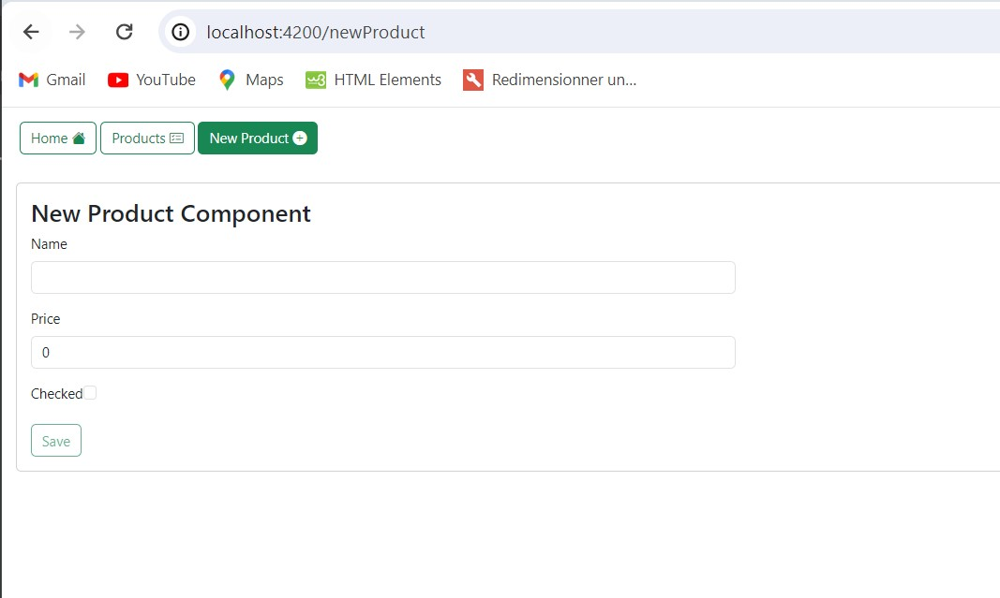
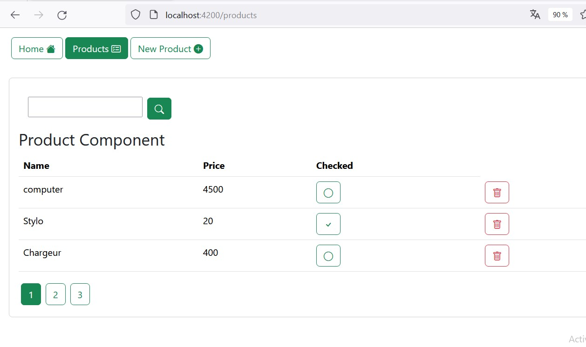

# App 2

This project was generated with [Angular CLI](https://github.com/angular/angular-cli) version 17.3.4. 

<h2>Deuxième Partie :</h2>
<h4>
Créer une application web Angular qui permet de gérer des produits avec un backend basé sur 
Json-server</h4>

<h3 style="color:blue;">PARTIE 1</h3>

<h3>Question 1</h3>

création et démarrage de l'application : Page d'accueil 

  

<h3>Question 2</h3>

Tester le REST API grace au server json

 

Tester le REST API : afficher le premier élément

  

<h3>Question 3</h3>

Afficher la liste des produits dans son composant respectif

  

<h3>Question 4</h3>

Cocher le produit directement depuis le tableau de produits 

  

<h3>Question 5</h3>

Cocher le produit directement depuis le tableau de produits et le modifier directement dans le server :
État initial

 

État suivant juste apres le checked depuis la liste

  

<h3>Question 6</h3>

Suppression d'un produit avec un message d'alerte 

  

<h3>Question 7</h3>

Formulaire d'ajout d'un nouveau produit 

 

Ajout d'un nouveau produit depuis le formulaire avec un message d'alerte 

 

Liste des produits apres ajout 

  

<h3>Question 8</h3>

Rechercher un produit par mot clé: exemple : com 

  

<h3 style="color:blue;">FIN PARTIE 1</h3>  

<h3 style="color:blue;">PARTIE 2</h3>

<h3>Question 9</h3>

Pagination de la liste des produits

  

<h3>Question 10</h3>

Editer un produit

 

Editer un produit : produit avec l'identifiant 1

 

Editer un produit Produit 1 édité(checked et name modifiés)

  

<h3 style="color:blue;">FIN PARTIE 2</h3>  

<h3 style="color:blue;">PARTIE 3</h3>

<h3>Question 11</h3>

Affichage d'un menu avec les des informations de comptages 

  

<h3>Question 12</h3>

Affichage du status de la requete : error 

  

<h3>Question 13</h3>

Utilisation d'un intercepteur : Ajout d'une autorization dans l'entete de la requete 

  

<h3>Question 14</h3>

Affichage du status de la requete avec unloading spinner : error 

  

<h3 style="color:blue;">FIN PARTIE 3</h3>  

<h3 style="color:blue;">PARTIE 4</h3>

<h3>Question 15</h3>

Affichage de la page d'authentification

  

<h3>Question 16</h3>

Page d'authentification : authentification

 

Page d'authentification : utilisateur authentifié

 

Page d'authentification : Acces avec le nouveau url vers les autres pages

  

<h3>Question 17</h3>

Obtention du token pour les nouveaux utilisateurs

  

<h3>Question 18</h3>

Liste des utilisateurs : RestAPI (users)

 

user1

  

<h3>Question 19</h3>

Authentification et verification avec le token grace au JWT avec Message d'erreur

  

<h3>Question 20</h3>

Authentification avec le nom de l'utilisateur affiché dans la barre de navigation

  

